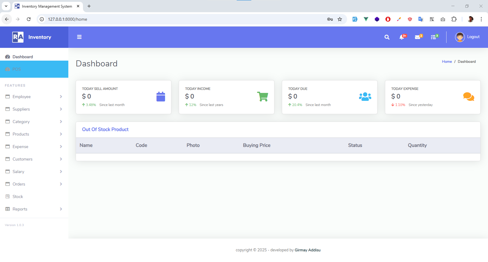

# Laravel Vue.js Inventory Management System

A modern inventory management system built with Laravel 8 backend API and Vue.js frontend, featuring JWT authentication and comprehensive inventory operations.

## 🚀 Features

- **Authentication System** - JWT-based login/register/logout
- **Employee Management** - CRUD operations for staff
- **Supplier Management** - Manage supplier information
- **Category Management** - Product categorization
- **Product Management** - Complete product lifecycle
- **Inventory Control** - Stock management and tracking
- **Customer Management** - Customer database
- **Point of Sale (POS)** - Sales interface
- **Order Management** - Order processing and tracking
- **Expense Tracking** - Business expense management
- **Salary Management** - Employee payroll system
- **Dashboard Analytics** - Sales, income, and inventory insights

## 🛠️ Tech Stack

**Backend:**
- Laravel 8
- JWT Authentication
- MySQL Database
- RESTful API

**Frontend:**
- Vue.js 2
- Vue Router
- Axios for API calls
- Bootstrap/CSS

## 📋 Prerequisites

- PHP >= 7.3
- Composer
- Node.js & NPM
- MySQL

## ⚡ Quick Start

### 1. Clone Repository
```bash
git clone https://github.com/girmiyadisu122542/Inventory.git
cd Inventory
```

### 2. Backend Setup
```bash
# Install PHP dependencies
composer install

# Copy environment file
cp .env.example .env

# Generate application key
php artisan key:generate

# Generate JWT secret
php artisan jwt:secret

# Configure database in .env file
DB_CONNECTION=mysql
DB_HOST=127.0.0.1
DB_PORT=3306
DB_DATABASE=inventory_db
DB_USERNAME=your_username
DB_PASSWORD=your_password

# Run migrations
php artisan migrate

# Start Laravel server
php artisan serve
```

### 3. Frontend Setup
```bash
# Install Node dependencies
npm install

# Compile assets
npm run dev

# For production
npm run production
```

## 📱 Screenshots

### Login Page

*Secure JWT authentication system*

### Dashboard

*Real-time analytics and key metrics*

### Product Management

*Complete product CRUD operations*

### Point of Sale

*Intuitive sales interface*

### Inventory Management

*Stock tracking and management*

## 🔗 API Endpoints

### Authentication
```
POST /api/auth/login     - User login
POST /api/auth/signup    - User registration
POST /api/auth/logout    - User logout
POST /api/auth/refresh   - Refresh token
```

### Core Resources
```
GET|POST /api/employee   - Employee management
GET|POST /api/supplier   - Supplier management
GET|POST /api/category   - Category management
GET|POST /api/product    - Product management
GET|POST /api/customer   - Customer management
GET|POST /api/expense    - Expense tracking
```

### Business Operations
```
GET /api/orders          - Order management
POST /api/orderdone      - Complete order
GET /api/stock           - Stock levels
POST /api/addToCart/{id} - Add to cart
GET /api/today/sell      - Today's sales
```

## 🎯 Frontend Routes

### Authentication
- `/` - Login page
- `/register` - User registration
- `/logout` - Logout

### Management Pages
- `/employee` - Employee list
- `/product` - Product catalog
- `/category` - Categories
- `/supplier` - Suppliers
- `/customer` - Customers
- `/expense` - Expenses
- `/salary` - Payroll

### Operations
- `/pos` - Point of Sale
- `/order` - Orders
- `/stock` - Inventory
- `/home` - Dashboard

## 🔧 Configuration

### JWT Configuration
```php
// config/jwt.php
'ttl' => env('JWT_TTL', 60),
'refresh_ttl' => env('JWT_REFRESH_TTL', 20160),
```

### Database Configuration
```php
// .env
DB_CONNECTION=mysql
DB_HOST=127.0.0.1
DB_PORT=3306
DB_DATABASE=inventory_db
```

## 🤝 Contributing

1. Fork the repository
2. Create feature branch (`git checkout -b feature/AmazingFeature`)
3. Commit changes (`git commit -m 'Add AmazingFeature'`)
4. Push to branch (`git push origin feature/AmazingFeature`)
5. Open Pull Request


## 👨‍💻 Author

**Girmay Addisu**
- GitHub: [@girmiyadisu122542](https://github.com/girmiyadisu122542)


⭐ **Star this repository if you find it helpful!**
